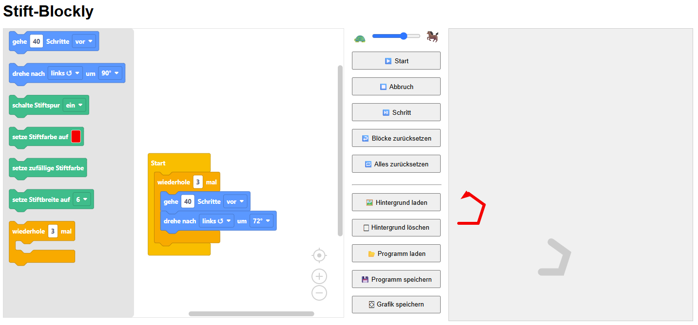

# ✏️ Stift-Blockly

Ein webbasiertes Zeichenprojekt mit Blockly – inspiriert von Turtle Graphics. Nutzer:innen können über Blöcke eine virtuelle „Stift“-Figur steuern, Farben und Breiten ändern und SVG-Grafiken exportieren.

## 🔍 Funktionen

- Blockly-Editor mit benutzerdefinierten Blöcken zum Zeichnen
- Schrittweiser oder vollständiger Programmlauf
- SVG-Hintergrund laden und löschen
- Export der Zeichnung als SVG-Datei
- Farbwahl und Stiftbreiten-Dropdown
- Freie Winkeleingabe mit Vorschauhilfe
- Speichern/Laden des Programmcodes als XML

## 🖼️ Screenshot



## 🚀 Online ausprobieren

> Wird unterstützt durch **GitHub Pages**.

👉 [Hier klicken, um das Projekt direkt im Browser zu starten](https://tonitaste.github.io/Stifty/)

## 📦 Installation (lokal)

Du kannst das Projekt lokal starten, indem du die Dateien einfach in einen Ordner speicherst und `index.html` in einem Browser öffnest:

```bash
git clone https://github.com/ToniTaste/Stifty.git
cd Stifty
# Dann: index.html im Browser öffnen
